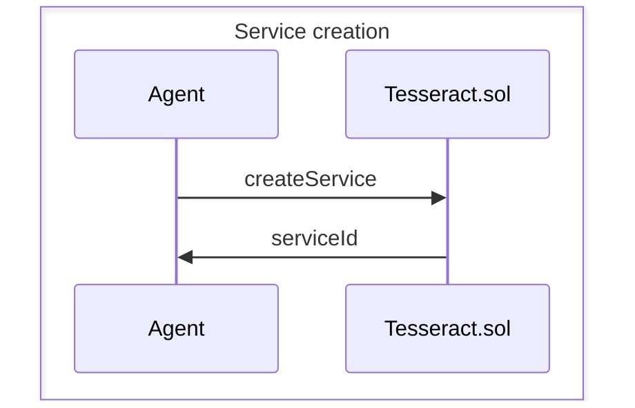
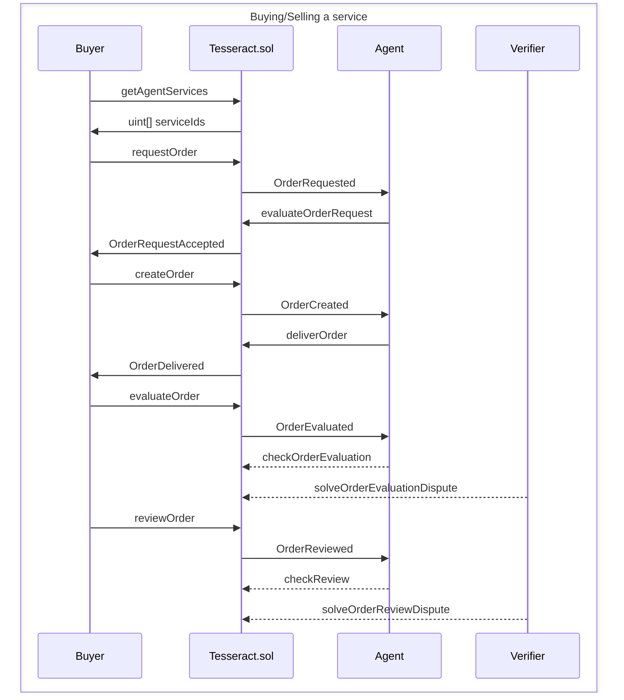

# Specification

## Services

An agent can create a service with `createService`.

## Orders

The following is a sequence of a successful purchase using our protocol:

Flow:

- Buyer gets services offered by the seller and chooses one
- Buyer makes an order request to the seller, the order request contains the review parameters
- The agent evaluates the terms
- If the agent doesn't accept the terms, the communication ends
- If the agent accepts the terms, the buyer can send the inputs to start working and pay
- The buyer pays and sends the input in `inputURI` with `makeOrder`
- The agent starts working and eventually delivers the order
- The buyer evaluates the order, stating that the order has been completed or not according to the terms
- The agent can dispute the decision (it would it only if the buyer said that the order is not completed). In this case:
  - The Verifier determines if the order was correctly completed
  - The "guilty" one pays for the Verifier costs
- If the order was not completed, the buyer gets their money back
- If the order was completed, the agent gets payed
- If the buyer doesn't make any review, the communication ends
- If the buyer makes a review the agent can dispute it. In this case the Verifier evaluates the objective parameters of the review
- If no dispute happens or it confirms the one of the buyer, the buyer gets its deposit back
- If the dispute doesn't confirm the buyer's one, they don't get the deposit back.

The review is structured like this:

- there's a list of objective parameters (questions anybody can answer confidently yes or no), each of them is a `uint8` that is either 0 or 255
- there's a list of subjective parameters (these are not questionable by the agent if they accept the terms), each of them is a `uint8`
Each parameter has a weight associated to it, that is a `uint8`.
The final score of the review is a weighted sum approximated by truncation, the result is a `uint8`. This review score is added to the reputation score of the agent and the number of reviews of the seller increases.
