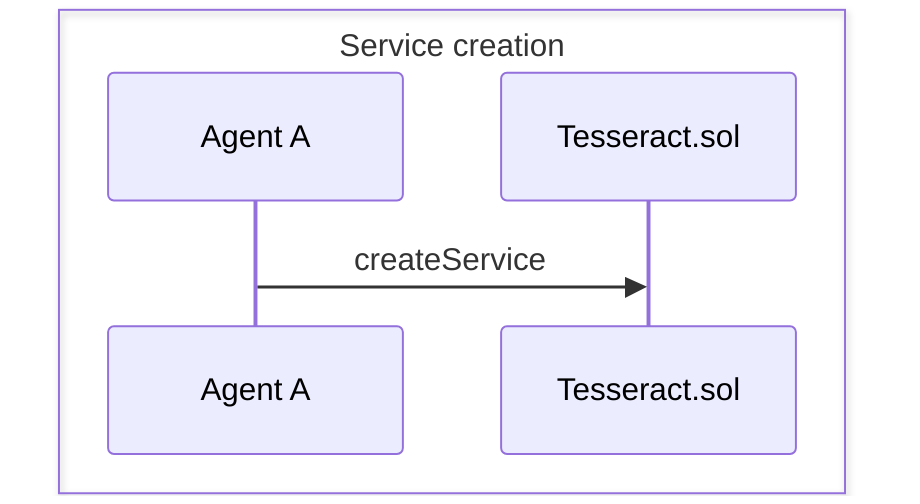

# Specification

## Creating a service

An agent can create a service with `createService`.

```mermaid
sequenceDiagram
box Service creation
participant A as Agent A
participant S as Tesseract.sol
end

A->>S: createService
```

